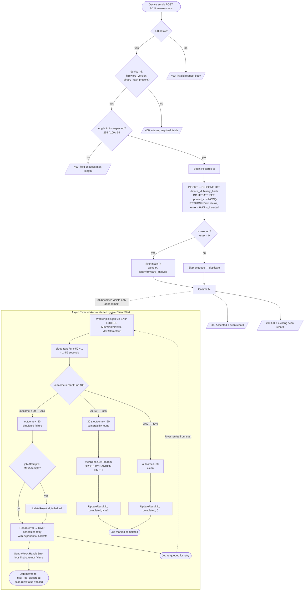

# Architecture Documentation

## System Diagram

The system has three runtime components (plus the device/client that talks to it):

- **Go API** — Echo-based HTTP server. Accepts scan registrations and CVE writes/reads, enqueues background jobs transactionally.
- **Go Background Worker (River)** — long-running worker process that picks up `firmware_analysis` jobs from Postgres via `SKIP LOCKED`, simulates analysis, and writes results back. Currently runs in the same binary as the API; in production it would be a separate deployment.
- **Postgres** — single source of truth. Holds the domain tables (`firmware_scans`, `vulnerabilities`) and the queue table (`river_jobs`). Uniqueness constraints + `ON CONFLICT` give us idempotency and cross-replica safety with no extra infrastructure.

---

## Flow: Firmware Scan (submit → background analysis)

End-to-end lifecycle of a single firmware scan from HTTP request through River worker completion, with every branch in the code shown as a decision node.

**Key invariants this flow guarantees:**
- The River job and the scan row commit **atomically** — if `tx.Commit` fails, no job is enqueued and no row exists.
- Workers cannot pick up a job before its scan row is visible (both live in the same committed snapshot).
- A duplicate submission is `O(1)` work: one upsert that touches `updated_at` and returns the existing row. No second job is ever enqueued.
- After `MaxAttempts` failed attempts the scan row reaches a **terminal** state (`failed`), so `GET /v1/firmware-scans/:id` always converges to one of `completed` / `failed` — never stuck in `pending` indefinitely.

---

## Flow: CVE Vulnerability Registry (PATCH + GET)

How the distributed CVE registry handles writes, concurrent writes from multiple replicas, and reads.

```mermaid
flowchart TD
    subgraph Write["PATCH /v1/findings/vulns — append"]
        WStart(["Client PATCHes vulns array"])

        WBind{"c.Bind ok?"}
        WBad400_Bind[/"400: invalid request body"/]

        WSize{"len vulns ≤ 1000?"}
        WBad400_Size[/"400: too many vulnerabilities"/]

        WEachID{"for each id:<br/>non-empty AND<br/>len ≤ 20 chars?"}
        WBad400_ID[/"400: invalid CVE ID"/]

        WUpsert["INSERT INTO vulnerabilities cve_id<br/>SELECT unnest text array<br/>ON CONFLICT cve_id DO NOTHING"]

        WErr{"DB error?"}
        WBad500[/"500: failed to register"/]
        WOk[/"204 No Content"/]

        WStart --> WBind
        WBind -- no --> WBad400_Bind
        WBind -- yes --> WSize
        WSize -- no --> WBad400_Size
        WSize -- yes --> WEachID
        WEachID -- no --> WBad400_ID
        WEachID -- yes --> WUpsert
        WUpsert --> WErr
        WErr -- yes --> WBad500
        WErr -- no --> WOk
    end

    subgraph Read["GET /v1/findings/vulns — read"]
        RStart(["Client GETs"])
        RQuery["SELECT cve_id FROM vulnerabilities<br/>ORDER BY cve_id ASC"]
        RErr{"DB error?"}
        RBad500[/"500: failed to get vulnerabilities"/]
        REmpty{"rows empty?"}
        RFix["coerce nil → empty string slice"]
        ROk[/"200 OK with vulns array"/]

        RStart --> RQuery --> RErr
        RErr -- yes --> RBad500
        RErr -- no --> REmpty
        REmpty -- yes --> RFix --> ROk
        REmpty -- no --> ROk
    end

    subgraph Concurrent["Concurrent writes from multiple replicas"]
        R1["Replica A:<br/>PATCH vulns = CVE-1, CVE-2"]
        R2["Replica B:<br/>PATCH vulns = CVE-2, CVE-3"]
        PG[("Postgres<br/>UNIQUE cve_id<br/>+ ON CONFLICT DO NOTHING")]
        Final["Final state: CVE-1, CVE-2, CVE-3<br/>no duplicates, no app-level locks"]

        R1 --> PG
        R2 --> PG
        PG --> Final
    end
```

**Where the deduplication conditions actually hit:**
- **In-batch duplicates within a single request** (e.g. `{vulns: ['CVE-1','CVE-1']}`): handled by `ON CONFLICT (cve_id) DO NOTHING`. The first row inserts, the second hits the conflict and is silently dropped. No in-memory dedup is needed because the DB resolves it in a single round-trip.
- **Cross-request duplicates** (id already exists from an earlier PATCH): same mechanism — `ON CONFLICT DO NOTHING`.
- **Cross-replica race** (two replicas PATCH the same id at the same moment): Postgres serializes the inserts at the unique-index level. Exactly one wins, the other gets `DO NOTHING`. No application-level locking, no Redis/Zookeeper, no distributed consensus required — the DB is the synchronization primitive.
- **Empty registry on read**: `repository.List` may return `nil`; service coerces to `[]string{}` so the JSON response is always `{"vulns": []}` and never `{"vulns": null}`.

---

## Task Checklist

### API: `POST /v1/firmware-scans`

- [DONE] Accept scan registrations with `device_id`, `firmware_version`, `binary_hash`, `metadata`
  - **How:** `api/firmware_scan.go` binds the request body to `model.FirmwareScan` and validates required fields.

- [DONE] Support large `metadata` JSON payloads
  - **How:** `metadata` is stored as `json.RawMessage` (passed through as raw bytes, never decoded), mapped to a Postgres `jsonb` column.

- [DONE] Devices may retry — duplicate requests must not cause redundant processing
  - **How:** `repository/firmware_scan.go` uses `INSERT ... ON CONFLICT (device_id, binary_hash) DO UPDATE SET updated_at = NOW()`. The Postgres `xmax` trick (`xmax = 0 AS is_inserted`) detects whether the row was freshly inserted or was a conflict. The River job is only enqueued in `service/firmware_scan.go` when `IsInserted = true`.

- [DONE] Register a scan and return it
  - **How:** Handler returns `202 Accepted` with the full scan record (including assigned `id` and `status = "pending"`) for new scans, or `200 OK` with the existing record for duplicate submissions. The `isNew` flag is plumbed from `service.CreateScan` (return signature: `(*scan, bool, error)`) so the handler can pick the right status code without a second DB roundtrip.

---

### API: `GET /v1/firmware-scans/:id` (status observability)

- [DONE] Allow devices/dashboards to observe scan outcome
  - **How:** `api/firmware_scan.go:GetScan` looks up the scan by primary key via `repository.GetByID`. Returns `200 OK` with the full record (status, vulns, timestamps), `404 Not Found` when the id doesn't exist, `400 Bad Request` for non-numeric ids. This makes the `pending → completed | failed` transition observable.

---

### API: `PATCH /v1/findings/vulns`

- [DONE] Append new CVE IDs to the global registry
  - **How:** `repository/vulnerability.go` uses `INSERT INTO vulnerabilities (cve_id) SELECT unnest($1::text[]) ON CONFLICT (cve_id) DO NOTHING`.

- [DONE] Deduplicate — final registry contains only unique IDs
  - **How:** `UNIQUE(cve_id)` constraint in Postgres is the authoritative guard; `ON CONFLICT DO NOTHING` makes concurrent inserts of the same ID safe without application-level locking.

- [DONE] Concurrent requests to different replicas must not produce duplicates
  - **How:** The `ON CONFLICT DO NOTHING` upsert is atomic at the DB level. All replicas share the same Postgres instance, so concurrent inserts are serialized by the DB engine — no application-level locking needed.

---

### API: `GET /v1/findings/vulns`

- [DONE] Return the current list of all unique CVE IDs
  - **How:** `repository/vulnerability.go` `List()` queries `SELECT cve_id FROM vulnerabilities ORDER BY cve_id ASC`. Returns `[]string{}` (not `null`) when the registry is empty.

---

### Functional Requirements

- [DONE] Validate incoming scan registrations
  - **How:** `api/firmware_scan.go` rejects requests missing `device_id`, `firmware_version`, or `binary_hash` with `400 Bad Request`, and also enforces length limits (`device_id ≤ 255`, `firmware_version ≤ 100`, `binary_hash ≤ 64`) to prevent oversized payloads from reaching the DB. `api/vulnerability.go` rejects batches over 1000 entries or containing empty/oversized CVE IDs (structural check only — does not enforce the `CVE-YYYY-NNNNN` format).

- [DONE] Trigger asynchronous analysis after registration
  - **How:** `service/firmware_scan.go` calls `river.InsertTx` inside the same DB transaction that creates the scan row. If the transaction rolls back, the job is never enqueued — no orphaned jobs.

- [DONE] Analysis process simulated
  - **How:** `worker/analysis_worker.go` sleeps a random 1–59 seconds (`randFunc(59)+1`), then randomly picks one of three outcomes: failure (`outcome < 30`), CVE found (`30 ≤ outcome < 60`), or clean (`outcome ≥ 60`).

- [DONE] Device firmware state updated **only after** analysis completes successfully
  - **How:** Worker calls `repo.UpdateResult(id, "completed", vulns)` only on the success path. On simulated failure the worker returns an error and River retries up to `MaxAttempts = 3` times. On the **final** failed attempt (`job.Attempt >= MaxAttempts`), the worker sets status to `"failed"` before returning the error so the row reaches a terminal state observable via `GET /v1/firmware-scans/:id`. `SentryMock` (registered as River's `ErrorHandler`) additionally logs final-attempt failures. The `status` column has a Postgres `CHECK (status IN ('pending', 'completed', 'failed'))` constraint so invalid statuses are rejected at the DB level.

---

### Non-Functional Requirements

- [DONE] Tolerate repeated requests for the same firmware
  - **How:** `ON CONFLICT (device_id, binary_hash)` upsert is idempotent. The second (and any further) request receives the existing scan record with no side effects.

- [DONE] Handle multiple requests for the same device arriving close together (race condition)
  - **How:** The unique constraint is enforced at the DB level. Two concurrent inserts for the same `(device_id, binary_hash)` — even from different replicas — will not both succeed; one will hit the conflict path and return the existing row without spawning a duplicate job.

- [DONE] Analysis may take several seconds
  - **How:** River processes jobs asynchronously in background workers. The HTTP handler returns immediately after enqueueing. Workers use `SKIP LOCKED` so many jobs can be processed in parallel without contention.

- [DONE] Tolerate temporary failures in dependent components
  - **How:** River retries failed jobs up to `MaxAttempts = 3` with exponential back-off. The 30% simulated failure demonstrates this path. DB connection pooling (`pgxpool`) handles transient Postgres connectivity issues.

- [DONE] Handle bursts from thousands of devices
  - **How:** Scan registration is a single transactional upsert + job insert — O(1) per request. River's `SKIP LOCKED` queue drains the backlog without worker contention. Additional River worker instances (horizontal scaling) can be added without any config change.

---

## Distributed Architecture (Multi-Replica)

- [DONE] Works correctly across multiple replicas
  - **How:** All shared state lives in Postgres — there is no in-process state. Any number of API replicas behind a load balancer all talk to the same DB, so reads and writes are always consistent.

- [DONE] No race conditions or duplicates under concurrent load
  - **How:** Uniqueness is enforced by DB constraints (`UNIQUE(device_id, binary_hash)` and `UNIQUE(cve_id)`), not by application code. Concurrent requests on different replicas that race to insert the same record will have one succeed and one hit the conflict handler — never a duplicate.

---

## Architectural Decisions

- **Web Framework:** [Echo](https://echo.labstack.com/) — high performance, minimal overhead.
- **Database driver:** [pgx/v5](https://github.com/jackc/pgx) — idiomatic, type-safe Postgres interface with connection pooling via `pgxpool`. The `pgxpool.Pool` is constructed once in `main.go` and explicitly injected into `server.NewServer` and the worker (no package-level singletons), so the API and worker share a single pool by construction rather than by accident.
- **Job queue:** [River](https://riverqueue.com/) — Postgres-native queue with transactional job insertion, persistence, and automatic retries. Chosen to avoid introducing a separate message-broker dependency while still getting reliable async processing.
- **Idempotency mechanism:** `INSERT ... ON CONFLICT ... RETURNING (xmax = 0)` — single round-trip that both upserts and tells the caller whether the row is new, avoiding a separate SELECT.
- **Process layout:** API server and River workers run in the **same process** (`cmd/api/main.go` calls `riverClient.Start(ctx)` and `server.ListenAndServe()` side-by-side). Simple for local runs; in production they would be split into two binaries so HTTP and analysis workloads can scale independently.

## Scaling Strategy

- **More devices:** Add API replicas (stateless) and River worker replicas (point at the same DB). No code changes required.
- **CVE registry at extreme scale:** Move to **Redis** `SADD` for O(1) set membership; keep Postgres as durable backup.
- **Job throughput at extreme scale:** Replace River with **NATS JetStream** or **RabbitMQ** for higher message rates while keeping the same worker interface.
