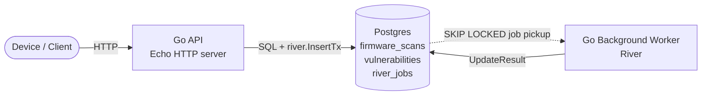
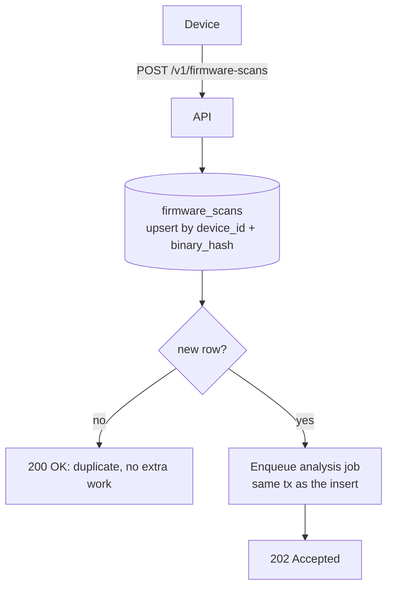
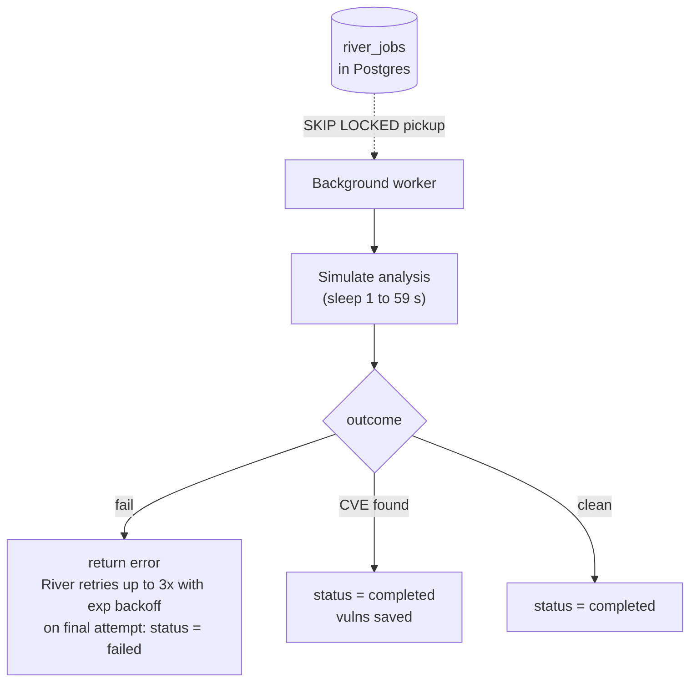
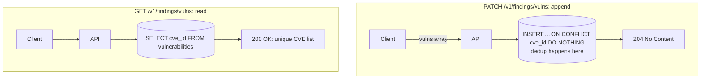

# Architecture Documentation

## System Diagram

Three runtime components, plus the device that calls the API:

- **Go API**: Echo HTTP server. Takes scan requests and CVE writes/reads. Enqueues jobs in the same DB transaction.
- **Go Background Worker (River)**: picks up `firmware_analysis` jobs from Postgres with `SKIP LOCKED`. Simulates analysis. Writes the result back. Runs in the same binary as the API today. In production it would be a separate Kubernetes deployment.
- **Postgres**: the single source of truth. Holds `firmware_scans`, `vulnerabilities`, and `river_jobs`. Unique constraints plus `ON CONFLICT` give idempotency and safety across replicas. No extra infrastructure needed.

---

## Flow: Firmware Scan (HTTP side)

How one scan goes from HTTP request to a 200/202 response.

**Why this flow is safe:**
- The scan row and the River job commit together. If `tx.Commit` fails, neither exists.
- A worker cannot pick up a job before the scan row is visible. They share the same committed snapshot.
- If we send a duplicate POST: one upsert (won't save data), no new job.

---

## Flow: Background Worker

How the River worker turns a queued job into a final scan status.

**Why River fits here:**
- **Automated retries.** Failed jobs run again up to `MaxAttempts = 3` with exponential backoff. No retry code in the worker.
- **Survives pod restarts.** Jobs live in Postgres, not in worker memory. If a pod dies mid-job, another worker picks it up via `SKIP LOCKED`. So `GET /v1/firmware-scans/:id` always ends in `completed` or `failed`. It never stays `pending` forever.
- **Observability on failure.** `SentryMock` is registered as River's `ErrorHandler`. It receives every final-attempt failure with the job id, args, and error. In production this would forward to Sentry or Datadog.

---

## Flow: CVE Vulnerability Registry (PATCH + GET)

How the registry handles writes, concurrent writes from many replicas, and reads.

**Where deduplication actually happens:**
- **Duplicates inside one request** (for example `{vulns: ['CVE-1','CVE-1']}`): `ON CONFLICT (cve_id) DO NOTHING` keeps the first row and drops the second. No in-memory dedup needed.
- **Duplicates across requests** (id already exists from an earlier PATCH): same mechanism.
- **Race across replicas** (two replicas PATCH the same id at the same moment): Postgres serializes the inserts on the unique index. One wins, the other gets `DO NOTHING`. No app locks. No Redis or Zookeeper. The DB is the sync point.
- **Empty registry on read**: `repository.List` can return `nil`. The service converts it to `[]string{}`. The JSON is always `{"vulns": []}`, never `null`.

---

## Task Checklist

### API: `POST /v1/firmware-scans`

- [DONE] Accept scan registrations with `device_id`, `firmware_version`, `binary_hash`, `metadata`
  - **How:** `api/firmware_scan.go` binds the body to `model.FirmwareScan` and checks required fields.

- [DONE] Support large `metadata` JSON payloads
  - **How:** `metadata` is `json.RawMessage`. It passes through as raw bytes and maps to a Postgres `jsonb` column.

- [DONE] Devices may retry. Duplicate requests must not cause redundant work
  - **How:** `repository/firmware_scan.go` uses `INSERT ... ON CONFLICT (device_id, binary_hash) DO UPDATE SET updated_at = NOW()`. The Postgres `xmax` trick (`xmax = 0 AS is_inserted`) tells us if the row is new. `service/firmware_scan.go` only enqueues the River job when `IsInserted = true`.

- [DONE] Register and return the scan
  - **How:** Returns `202 Accepted` with the new scan record. Returns `200 OK` with the existing record for duplicate submissions. The `isNew` flag comes from `service.CreateScan` (signature `(*scan, bool, error)`). So the handler picks the status code without a second DB call.

---

### API: `GET /v1/firmware-scans/:id` (status check)

- [DONE] Let devices and dashboards check the scan result
  - **How:** `api/firmware_scan.go:GetScan` reads the scan by id with `repository.GetByID`. Returns `200 OK` with the full row. Returns `404 Not Found` if the id is missing. Returns `400 Bad Request` for a non-numeric id. This makes the `pending` to `completed`/`failed` transition visible.

---

### API: `PATCH /v1/findings/vulns`

- [DONE] Append new CVE IDs to the registry
  - **How:** `repository/vulnerability.go` uses `INSERT INTO vulnerabilities (cve_id) SELECT unnest($1::text[]) ON CONFLICT (cve_id) DO NOTHING`.

- [DONE] Keep only unique IDs
  - **How:** `UNIQUE(cve_id)` is the DB-level guard. `ON CONFLICT DO NOTHING` makes concurrent inserts of the same id safe without app locks.

- [DONE] Concurrent requests on different replicas must not create duplicates
  - **How:** The upsert is atomic at the DB level. All replicas share the same Postgres. So conflicts are serialized by the DB itself.

---

### API: `GET /v1/findings/vulns`

- [DONE] Return the list of all unique CVE IDs
  - **How:** `repository/vulnerability.go` `List()` runs `SELECT cve_id FROM vulnerabilities ORDER BY cve_id ASC`. Returns `[]string{}` (not `null`) when empty.

---

### Functional Requirements

- [DONE] Validate scan requests
  - **How:** `api/firmware_scan.go` returns `400 Bad Request` for missing `device_id`, `firmware_version`, or `binary_hash`. It also enforces length limits (`device_id ≤ 255`, `firmware_version ≤ 100`, `binary_hash ≤ 64`) so big payloads never reach the DB. `api/vulnerability.go` rejects batches over 1000 IDs and empty or too-long IDs. It does a structural check only. It does not enforce the `CVE-YYYY-NNNNN` format.

- [DONE] Run analysis asynchronously after registration
  - **How:** `service/firmware_scan.go` calls `river.InsertTx` inside the same DB transaction that creates the scan row. If the tx rolls back, the job is never enqueued. No orphan jobs.

- [DONE] Analysis is simulated
  - **How:** `worker/analysis_worker.go` sleeps a random 1 to 59 seconds (`randFunc(59)+1`). Then it picks one of three outcomes: failure (`outcome < 30`), CVE found (`30 ≤ outcome < 60`), or clean (`outcome ≥ 60`).

- [DONE] Update the firmware state only after a successful analysis
  - **How:** The worker calls `repo.UpdateResult(id, "completed", vulns)` only on the success path. On simulated failure it returns an error. River retries up to `MaxAttempts = 3` times. On the final failed attempt (`job.Attempt >= MaxAttempts`), the worker sets `status = "failed"` before returning the error. So the row reaches a terminal state visible through `GET /v1/firmware-scans/:id`. `SentryMock` (registered as River's `ErrorHandler`) also logs final-attempt failures. The `status` column has a `CHECK (status IN ('pending', 'completed', 'failed'))` constraint so the DB rejects bad values.

---

### Non-Functional Requirements

- [DONE] Tolerate repeated requests for the same firmware
  - **How:** The `ON CONFLICT (device_id, binary_hash)` upsert is idempotent. Repeated requests return the existing scan record with no side effects.

- [DONE] Handle near-simultaneous requests for the same device
  - **How:** The unique constraint is enforced at the DB level. Two parallel inserts for the same `(device_id, binary_hash)` cannot both win. One hits the conflict path and returns the existing row without spawning a duplicate job.

- [DONE] Analysis may take several seconds
  - **How:** River runs jobs asynchronously in background workers. The HTTP handler returns right after enqueueing. Workers use `SKIP LOCKED` so many jobs run in parallel with no contention.

- [DONE] Tolerate temporary failures in dependencies
  - **How:** River retries failed jobs up to `MaxAttempts = 3` with exponential backoff. The 30% simulated failure exercises this path. `pgxpool` handles short Postgres outages.

- [DONE] Handle bursts of thousands of devices
  - **How:** Scan registration is one upsert + one job insert. River's `SKIP LOCKED` queue drains the backlog without worker contention. More worker instances can be added without any config change.

---

## Distributed Architecture (Multi-Replica)

- [DONE] Works across multiple replicas
  - **How:** All shared state lives in Postgres. There is no in-process state. Any number of API replicas behind a load balancer can use the same DB. Reads and writes stay consistent.

- [DONE] No race conditions or duplicates under load
  - **How:** Uniqueness is enforced by DB constraints (`UNIQUE(device_id, binary_hash)` and `UNIQUE(cve_id)`). Not by application code. Two replicas racing on the same key cannot both win. One hits the conflict handler.

---

## Architectural Decisions

- **Web framework:** [Echo](https://echo.labstack.com/). High performance, low overhead.
- **DB driver:** [pgx/v5](https://github.com/jackc/pgx). Idiomatic, type-safe Postgres client with `pgxpool` for connection pooling. The pool is built once in `main.go` and injected into `server.NewServer` and the worker. No package globals. So the API and worker share one pool by design.
- **Job queue:** [River](https://riverqueue.com/). Postgres-native queue with transactional job insertion, persistence, and automatic retries. No extra broker needed.
- **Idempotency:** `INSERT ... ON CONFLICT ... RETURNING (xmax = 0)`. One round-trip that upserts and tells us if the row is new. No second `SELECT` needed.
- **Process layout:** The API and River workers run in the same process. `cmd/api/main.go` starts `riverClient.Start(ctx)` and `server.ListenAndServe()` side by side. Simple for local runs. In production they would be split into two binaries so HTTP and analysis workloads can scale on their own.

## Scaling Strategy

- **More devices:** Add API replicas (stateless) and River worker replicas. All point at the same DB. No code changes.
- **Job throughput at extreme scale:** Replace River with NATS JetStream or RabbitMQ for higher message rates. Keep the same worker interface.
