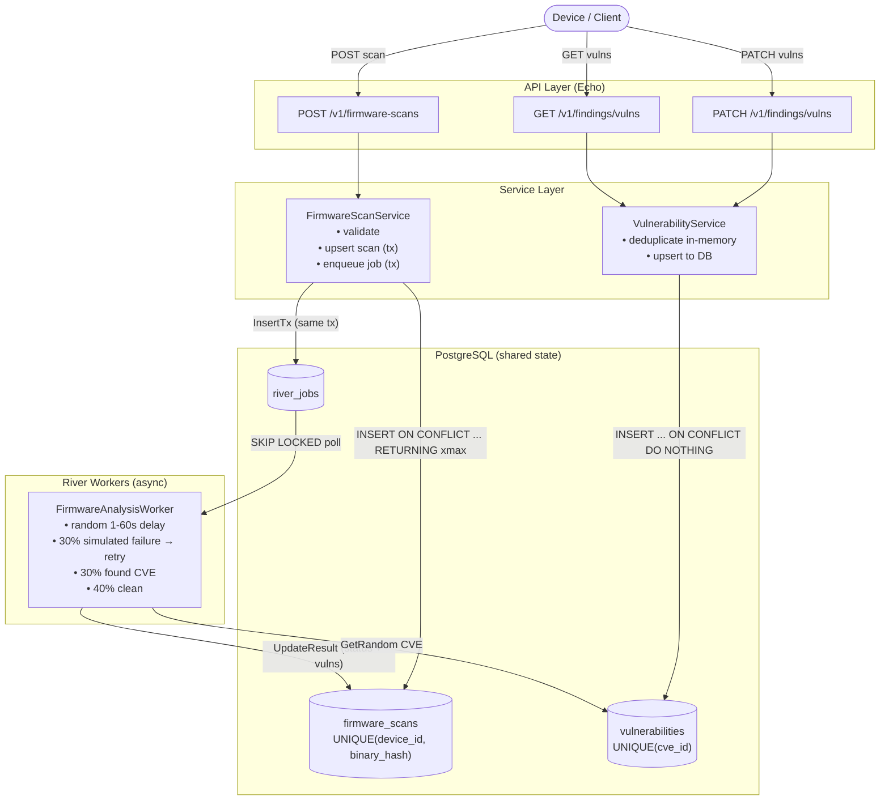

# Architecture Documentation

## System Diagram

---

## Task Checklist

### API: `POST /v1/firmware-scans`

- [DONE] Accept scan registrations with `device_id`, `firmware_version`, `binary_hash`, `metadata`
  - **How:** `api/firmware_scan.go` binds the request body to `model.FirmwareScan` and validates required fields.

- [DONE] Support large `metadata` JSON payloads
  - **How:** `metadata` is stored as `json.RawMessage` (passed through as raw bytes, never decoded), mapped to a Postgres `jsonb` column.

- [DONE] Devices may retry — duplicate requests must not cause redundant processing
  - **How:** `repository/firmware_scan.go` uses `INSERT ... ON CONFLICT (device_id, binary_hash) DO UPDATE SET updated_at = NOW()`. The Postgres `xmax` trick (`xmax = 0 AS is_inserted`) detects whether the row was freshly inserted or was a conflict. The River job is only enqueued in `service/firmware_scan.go` when `IsInserted = true`.

- [DONE] Register a scan and return it
  - **How:** Handler returns `202 Accepted` with the full scan record (including assigned `id` and `status = "pending"`).

---

### API: `PATCH /v1/findings/vulns`

- [DONE] Append new CVE IDs to the global registry
  - **How:** `repository/vulnerability.go` uses `INSERT INTO vulnerabilities (cve_id) SELECT unnest($1::text[]) ON CONFLICT (cve_id) DO NOTHING`.

- [DONE] Deduplicate — final registry contains only unique IDs
  - **How:** Two layers: in-memory dedup in `service/vulnerability.go` (avoids wasted DB round-trips), then `UNIQUE(cve_id)` constraint in Postgres as the authoritative guard.

- [DONE] Concurrent requests to different replicas must not produce duplicates
  - **How:** The `ON CONFLICT DO NOTHING` upsert is atomic at the DB level. All replicas share the same Postgres instance, so concurrent inserts are serialized by the DB engine — no application-level locking needed.

---

### API: `GET /v1/findings/vulns`

- [DONE] Return the current list of all unique CVE IDs
  - **How:** `repository/vulnerability.go` `List()` queries `SELECT cve_id FROM vulnerabilities ORDER BY cve_id ASC`. Returns `[]string{}` (not `null`) when the registry is empty.

---

### Functional Requirements

- [DONE] Validate incoming scan registrations
  - **How:** `api/firmware_scan.go` rejects requests missing `device_id`, `firmware_version`, or `binary_hash` with `400 Bad Request`. `api/vulnerability.go` rejects batches over 1000 entries or containing empty/oversized CVE IDs.

- [DONE] Trigger asynchronous analysis after registration
  - **How:** `service/firmware_scan.go` calls `river.InsertTx` inside the same DB transaction that creates the scan row. If the transaction rolls back, the job is never enqueued — no orphaned jobs.

- [DONE] Analysis process simulated
  - **How:** `worker/analysis_worker.go` sleeps a random 1–60 seconds, then randomly picks one of three outcomes (failure / CVE found / clean).

- [DONE] Device firmware state updated **only after** analysis completes successfully
  - **How:** Worker calls `repo.UpdateResult(id, "completed", vulns)` only on the success path. On simulated failure the worker returns an error, River retries up to `MaxAttempts = 3` times; the scan row stays in `"pending"` until a successful attempt.

---

### Non-Functional Requirements

- [DONE] Tolerate repeated requests for the same firmware
  - **How:** `ON CONFLICT (device_id, binary_hash)` upsert is idempotent. The second (and any further) request receives the existing scan record with no side effects.

- [DONE] Handle multiple requests for the same device arriving close together (race condition)
  - **How:** The unique constraint is enforced at the DB level. Two concurrent inserts for the same `(device_id, binary_hash)` — even from different replicas — will not both succeed; one will hit the conflict path and return the existing row without spawning a duplicate job.

- [DONE] Analysis may take several seconds
  - **How:** River processes jobs asynchronously in background workers. The HTTP handler returns immediately after enqueueing. Workers use `SKIP LOCKED` so many jobs can be processed in parallel without contention.

- [DONE] Tolerate temporary failures in dependent components
  - **How:** River retries failed jobs up to `MaxAttempts = 3` with exponential back-off. The 30% simulated failure demonstrates this path. DB connection pooling (`pgxpool`) handles transient Postgres connectivity issues.

- [DONE] Handle bursts from thousands of devices
  - **How:** Scan registration is a single transactional upsert + job insert — O(1) per request. River's `SKIP LOCKED` queue drains the backlog without worker contention. Additional River worker instances (horizontal scaling) can be added without any config change.

---

## Distributed Architecture (Multi-Replica)

- [DONE] Works correctly across multiple replicas
  - **How:** All shared state lives in Postgres — there is no in-process state. Any number of API replicas behind a load balancer all talk to the same DB, so reads and writes are always consistent.

- [DONE] No race conditions or duplicates under concurrent load
  - **How:** Uniqueness is enforced by DB constraints (`UNIQUE(device_id, binary_hash)` and `UNIQUE(cve_id)`), not by application code. Concurrent requests on different replicas that race to insert the same record will have one succeed and one hit the conflict handler — never a duplicate.

---

## Architectural Decisions

- **Web Framework:** [Echo](https://echo.labstack.com/) — high performance, minimal overhead.
- **Database driver:** [pgx/v5](https://github.com/jackc/pgx) — idiomatic, type-safe Postgres interface with connection pooling via `pgxpool`.
- **Job queue:** [River](https://riverqueue.com/) — Postgres-native queue with transactional job insertion, persistence, and automatic retries. Chosen to avoid introducing a separate message-broker dependency while still getting reliable async processing.
- **Idempotency mechanism:** `INSERT ... ON CONFLICT ... RETURNING (xmax = 0)` — single round-trip that both upserts and tells the caller whether the row is new, avoiding a separate SELECT.

## Scaling Strategy

- **More devices:** Add API replicas (stateless) and River worker replicas (point at the same DB). No code changes required.
- **CVE registry at extreme scale:** Move to **Redis** `SADD` for O(1) set membership; keep Postgres as durable backup.
- **Job throughput at extreme scale:** Replace River with **NATS JetStream** or **RabbitMQ** for higher message rates while keeping the same worker interface.
